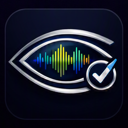
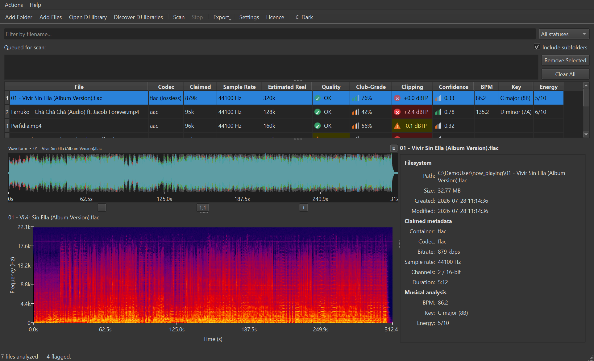
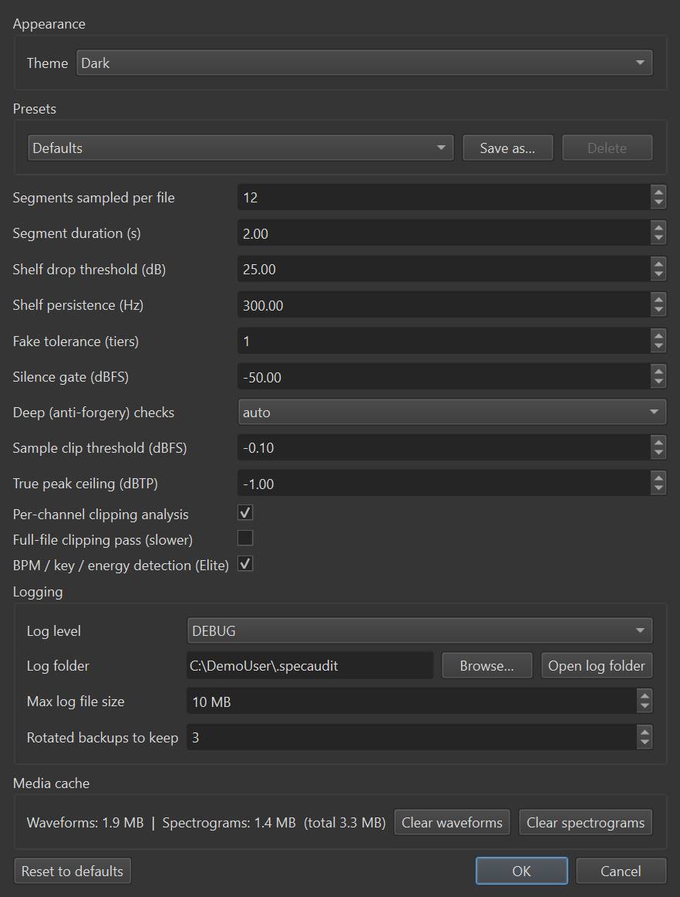

# SpectralAuditO Showcase

## See through fake audio quality

Bulk-scan your music and video library with real spectral analysis - catch upscaled MP3s, lossy-in-lossless fakes, clipping, and corrupt files before they ruin a set.

---

## Real detection, not guesswork

SpectralAuditO decodes the actual audio and runs spectral (FFT) analysis to find the frequency cutoff a lossy encoder leaves behind - the tell-tale sign of a file that's been upscaled or mislabeled, no matter what the container metadata claims.

### Key Features

**Fake & Quality Detection**
Finds the real encoded bitrate tier from the spectrum itself, flags transcoded-up files and lossy-in-lossless fakes, and catches truncated/corrupt files and clipping.

**Graduated Club-Grade Score**
A 0-100% score - shown as Wi-Fi-style signal bars - rating how safe a track is to play at volume, blending bitrate tier, true-peak headroom, suspicion flags, and loudness range into one number.

**Musical Metrics (Elite)**
Opt-in BPM/beatgrid, musical key with Camelot-wheel notation, and a 1-10 perceptual energy rating - shown as separate columns and exported to every report.

**DJ Library Integration**
Scan straight from Rekordbox, VirtualDJ, or Serato, and write verdicts back into your library so flagged tracks are visible right in your DJ software.

**File Operations, Done Safely**
Rename, move, copy, delete, or fix bitrate tags in bulk - every action shows a dry-run preview first, and a full undo journal has your back.

**CSV / JSON / HTML Reports**
Export every metric to CSV or JSON for your own analysis, or a self-contained HTML report with an analytics dashboard and embedded spectrogram thumbnails.

---

## In Action

### Main Results Window

Scan results with spectrogram viewer, quality detection, Club-Grade scoring, and clipping indicators.

### Settings & Configuration

Configure analysis depth, musical metrics, DJ integration, and visual theme.

---

## Choose Your Tier

### Free
- Bulk audio/video scanning
- Quality detection (fake, corrupt, clipping)
- CSV/JSON/HTML reports
- File operations with undo

### Pro
- Everything in Free
- DJ library integration (Rekordbox, VirtualDJ, Serato, M3U)
- Musical metrics (BPM, key, energy)
- Advanced filtering & export

### Pro + DJ Add-on
- Seamless DJ software integration
- Write verdicts back to your library
- Deck integration for live monitoring

### Pro + Elite Add-on
- Full musical analysis suite
- Advanced key/tempo detection
- Energy rating & loudness analysis

---

## System Requirements

- Windows: 10/11 (64-bit)
- macOS: 12+ (Intel or Apple Silicon)
- Linux: Ubuntu 20.04+ (unverified)
- No separate ffmpeg needed - it's bundled
- No admin rights required for portable versions

---

## Get Started

Visit the [Downloads](https://github.com/PragueHome/SpectralAuditO-Releases/releases/latest) page to grab the latest build for your platform.

For detailed usage instructions, see the [User Guide](docs/USER_GUIDE.md).

---

**SpectralAuditO** - true encoded quality, at a glance.

For support or licensing inquiries, contact salsedine@gmail.com
